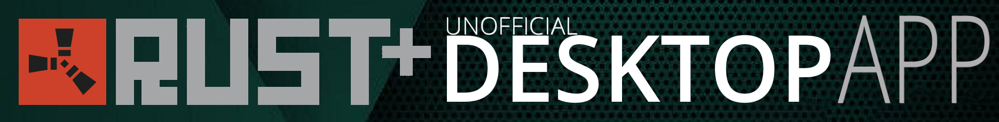  
[](https://discord.gg/v4X584wye4)


[](https://www.patreon.com/c/Pronwan)


# Rust+ Desktop App (Unofficial)


⚠️ **Note**: This is an **unofficial** project and is not affiliated with Facepunch Studios or the game *Rust*.  

It is open source so anyone can verify there is **no malware or hidden components**.

⚠️ **Note**: If you used it for a while and can't pair new servers anymore, simply click on the Pairing button with right mouse button and select to delete the config file.

---


## 🔍 What is this?


The **Rust+ Desktop App** is a Windows application built on the official Rust+ Companion API.  

It lets you pair Rust servers, monitor in-game events, control Smart Devices, and view dynamic map markers — all on your PC.
By now it's more than 'just' Rust Plus. It's Rust² you could say... That's why this is our new icon ;) Was about time.
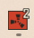  


The app ships as a single installer (bundling .NET, Node.js, WebView2 runtime, RustPlusAPI, etc.), so you don’t have to install dependencies manually.


---


## 🚀 Latest Release


➡️ **[Download the latest RustPlusDesk-Setup.exe](../../releases/latest)**


*(I publish the signed/packaged installer as a GitHub Release asset for clean versioning and smaller repositories.)*
[](https://www.youtube.com/watch?v=wrqGoTCtAjs)

[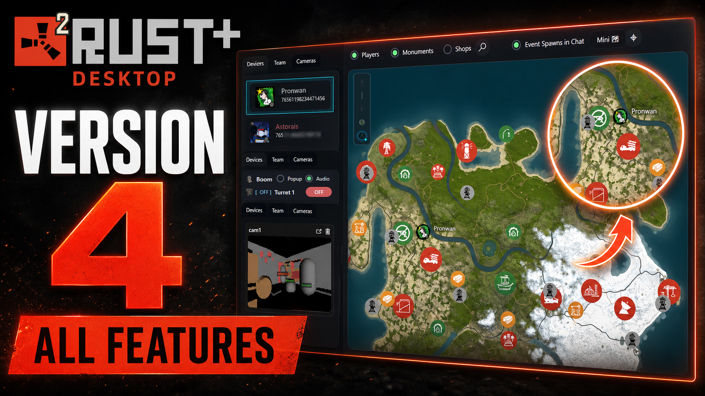](https://youtu.be/tmbAn3lIKmM)  
*(click the image to watch on YouTube)*

## 🚀 Patch 5.4.0 is live! 🌍 Global Localization & more
**30+ Languages:** The app now supports over 30 languages with instant, on-the-fly switching.


**🎨 UI Modernization & Overlays**
New Sidebars: Replaced bulky pop-up windows with sleek, modern sidebar overlays for settings.
Cleaner chat views: Chat commands and alerts now open in isolated views to prevent chat clutter.
Your own Map Marker is now slightly darker than your teammates' markers for better visibility.

**🚨 Smart Alert Rework**
Audio alerts can now loop! The mandatory in-app alert popup now acts as your "stop" button when closed.

**🛡️ Data Management & Security**
Backup & Restore: You can now easily backup and restore your server profiles, tracked players, and drawings to an encrypted file.
Granular Reset: Selectively wipe specific app data (e.g., just the cache or pairing config) without needing a full reinstall.
Improved background processes to eliminate UI freezes during state transitions.

**🏗️ Storage & Smart Home**
Fixed the annoying "0 items" Storage Monitor bug – upkeep and items now sync immediately upon connecting!
Improved accuracy for the !upkeep and !upkeepdetail commands.

**🛠️ Bug Fixes & Stability**
Fixed race condition crashes when rapidly switching servers or opening the player window.
Player lists now populate instantly upon "soft connecting".
Fixed infinite loading spinners, broken UI flags, and search filters.

## 🛠️ v5.1.0 🛠️

The "Game Changer" just got a lot more polish. This beta is all about workflow and stability.

What’s new in this version?

- **📦 Shop Integration:** No more popups! Arbitrage and "Buy X" are now built directly into the Shop Detail Panel.
- **⏳ Precise Timers:** Live countdowns for all events in the dock + chat commands to query event status.
- **🗺️ Minimap Upgrade:** Added Circle/Square/16:9 layouts, opacity slider, and a real-time server clock!
- **🏗️ Builder Heaven:** Added !upkeepdetail for granular 24h upkeep reports from your Storage Monitors.
- **🔔 Smart Alerts:** New In-App popup alerts and "Alarm to Team Chat" options.
- **🛡️ Lag Protection:** Increased handshake timeout (15s) and added a chat-alert delay to prevent spam on laggy API servers.
- **⚠️ Player Tracking Overhaul:** The player Tracking System has been changed completely. Please review the changes in Patch Notes in-app to understand what's happening.

## 🚀 Rust+ Desk v5.0  – Game Changer Update!
This release is packed with architectural hardening by @JawadYzbk & significant QoL upgrades.

**🛠️ Core & System**
- Auto-Update System: No more manual downloads! The app now features a background update checker with detailed progress reporting (speed, size, percentage).
- Centralized Runtime Management: More reliable detection and management of Node.js and background CLI processes.
- FCM Hardening: A complete architectural rewrite of background communication to eliminate UI freezes and crashes during connection transitions.

**🗺️ Interface & Map**
Modern Edge-to-Edge Design: A sleek, borderless layout for a truly modern look.
Interpolated Map Movement: Silky-smooth real-time tracking for players and map events.
BattleMetrics Refactor: The BM button has been upgraded to a clean icon and moved directly onto the server connection card.

**👤 Player & Team Tracking**
- Advanced Player List: Rebuilt from the ground up for better performance and styling.
- Custom Grouping: Organize your tracked players with custom Group Names and Colors.
- Live Indicators: Added "Is Online" status and Play Time counters directly to the player cards.

**🏠 Smart Home & Automation**
- Storage Monitor Support: Automatic recognition of Storage Monitors for chat commands.
- Enhanced !Upkeep: Now supports an arbitrary number of connected Tool Cupboards simultaneously.
- Smart Alarm Fix: Audio alerts for Smart Alarms are now working reliably again.

**🛡️ Security & Identity**
- FCM Token Expiry Tracking: The app now proactively warns you via a new sidebar InfoBar before your pairing expires.
- Steam Identity (Preview): New Steam profile integration in the sidebar, laying the groundwork for future account-linked features.

**🛠️ Bug Fixes:** We fixed a LOT of smaller bugs, issues, improved the UI dramatically, the Battlemetrics integration etc. 

## Update 4.5.1 — The Intelligence Update (May 12th) + Shop Polling Hotfix
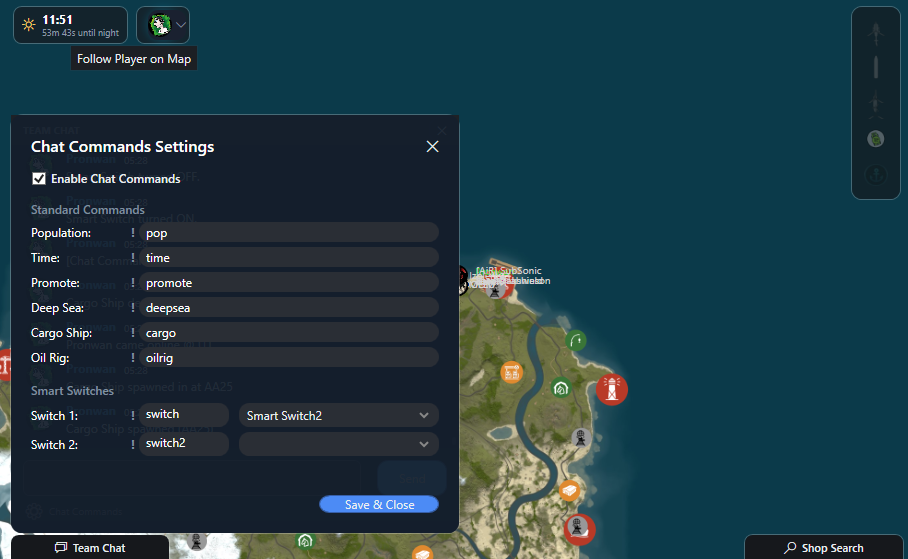

**📍 Smart Map Follow**
- **Player Tracking**: Lock the camera onto any teammate or yourself. The map smoothly centers on the target, making it ideal for tracking raids or roams in real-time.

**💬 Chat Command Automation**
- **Switch Control**: Control your base from anywhere by assigning aliases to Smart Switches. Use !toggle, !on, or !off in team chat.
- **Direct Setup**: Manage all your chat command bindings directly within the Team Chat Overlay.

**🛡️ Stability Overhaul**
- **Reliable Sync**: Fixed "ghost" devices and stale data by implementing a complete session reset on disconnect.
- **Fast Probing**: Optimized device checks to prevent UI hangs during server lag or when devices are missing.

## Update 4.2 — Cargo Ship Overhaul (May 5th)


**🚢 Smart Cargo Tracking**

- Route Learning: After the first full Cargo cycle, the app remembers docking times, total map life, and trigger points — saved per server and map wipe, resets automatically after a wipe.
- Docking Countdown: A live countdown appears below the Cargo Ship while it's anchored at harbor. Docking duration is learned per server; the default fallback is 8 minutes.
- Remaining On-Map Timer: Once a full cycle is tracked, a remaining-time countdown is shown in the Event Dock and on the Cargo Ship marker. 


**💬 Cargo Chat Notifications**

- Arrival Warning: Team chat alert ~5 minutes before Cargo docks at the next harbor (requires a learned route).
- Docking Alert: Notification when Cargo anchors at a harbor.
- Departure Warning: Notification 5 minutes before Cargo leaves.
- All three can be toggled individually via right-click on the Chat Alerts button.

**🛢️ Oil Rig Crate Countdown**
~~- The app detects when a Chinook hovers over an Oil Rig and automatically starts a crate countdown on the map.~~
 
(fixed by FP - we'll try to bring it back in)


## Update 4.1.0 - Crosshair Editor (Right Click Crosshair icon to access) (May 1st)

**𖦏 Custom Crosshairs**
- **Draw your own**: intuitive pixel-art style editor. Supports drawing tools (Pen, Pixel, Line, Square, Circle), custom colors, adjustable thickness and opacity, and full Undo/Redo support.
- **Upload PNGs**: Upload existing PNG images to use as crosshairs. The editor automatically scales them to fit the pixel grid. You can also right-click to erase individual pixels and easily rename or delete your creations.
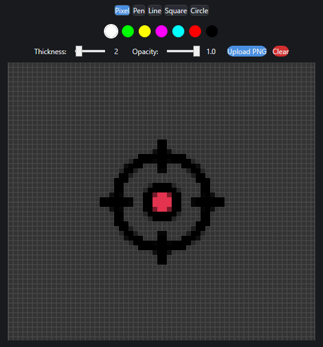
---

## Update 4.0.0 - The Evolution Update | Major Map & Stability Overhaul (April 30th)

**🚀 Key Highlights**
- **Rebuilt Core Architecture**: A massive refactoring of over 4,000 lines of code into a modular system, ensuring the app is faster and future-proof.
- **"Dead Reckoning" Resilience**: Markers and shops no longer disappear during brief server lags. The app now uses predictive interpolation to keep player and event icons moving smoothly even when data is delayed.
- **Interactive Event Dock**: A new real-time sidebar for active events (Patrol Heli, Cargo Ship, Chinook, etc.). Click any event to **auto-lock and track** it dynamically across the map.
- **Smart Shop Clustering**: Multiple vending machines in one base are now grouped into clean cluster icons. Hovering over them reveals a redesigned, scrollable list of all items without map clutter.

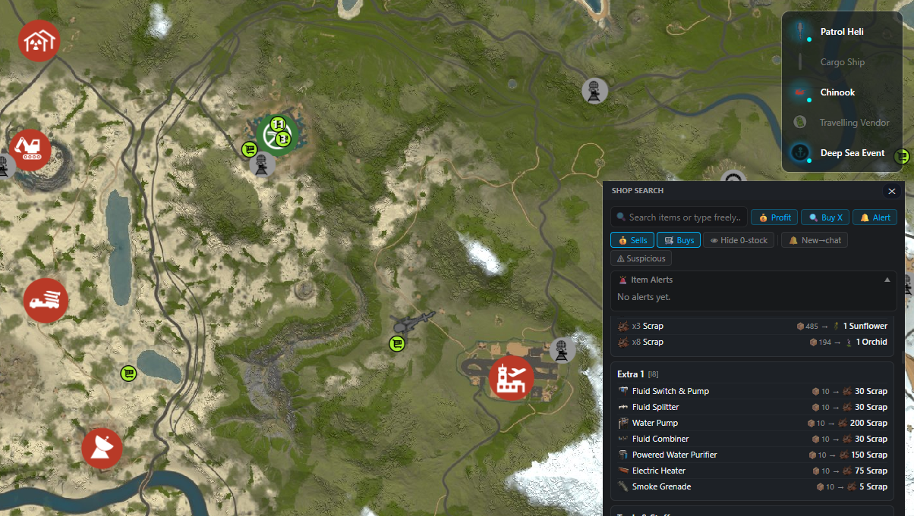

**🛠 Improvements**
- **60 FPS Map Animations**: Butter-smooth zooming and panning with a new cinematic "Overview Dip" when jumping across the map.
- **Modern Shop Search**: Powered by WebView2, the new search interface is near-instant and includes advanced arbitrage (Profit Trades) and pathfinding tools.
- **Offline Icon Caching**: All item icons are now securely cached locally using SHA1 hashes, making map loads instant and saving massive bandwidth.
- **Flexible UI**: Added a GridSplitter for a resizable sidebar and the ability to hide the system console to maximize map space.

**🙌 Special Thanks**
This milestone release was made possible by the incredible contribution of **[JawadYzbk](https://github.com/JawadYzbk)**, who rebuilt the core architecture and implemented the advanced map features!

---

## Update 3.5.0 - Player Intelligence & Background Ops (April 22nd)
**🚀 New Features**
- **Advanced Activity Intelligence**: Introducing a full-scale player tracking system! View 12-week GitHub-style activity grids and 24-hour heatmaps to predict when your enemies (or friends) are most likely to be online or sleeping.
- **Background Operations**: The app can now reside in your System Tray. Collect player data 24/7 without having the main window open.
- **Single Instance Management**: Launching the app via `rustplus://` links or a second desktop shortcut now automatically focuses your already running instance.
- **Auto-Start**: New option to launch the app minimized with Windows, so your tracking database is always up to date.

**🛠 Improvements & Fixes**
- **Battlemetrics Accuracy**: Completely overhauled server identification. Fixed an issue where servers on shared IP ranges (like Rustoria) were sometimes incorrectly identified. 
- **Tray Menu**: Dynamic tray context menu showing current tracking status and last update time.

**🙌 Special Thanks**
A massive shout-out to [JawadYzbk](https://github.com/JawadYzbk) for contributing this entire intelligence system and background logic!

## Update 3.4.0 - Custom Alarms & Device Grouping (April 26)
**🚀 New Features**
- Customizable Smart Alarms: You can now set individual popup alerts and custom audio files. Perfect for turning up the volume and getting woken up specifically for Raids!
- Smart Device Groups: Organize your setup by merging devices into groups. You can rename these groups and control multiple devices simultaneously with a single click (bringing the power of hotkeys to the UI).

**🛠 Improvements**
- Enhanced Team Uploads: Device uploads for team members now fully support hierarchical group structures. No matter how many devices you manage, everything stays organized and easy to navigate.

## Update Notes 3.3.1 (February 16th 26)
~~- **New Pre Deep Sea Notification:** Before Deep Sea is triggered, you can get a notification in Team Chat (around 3 minutes ahead of actual spawn) -> note that the direction will always be shown in West - this is not the actual spawn location. It's just coming from the fact that Deep Sea shops have negative X-coordinates.~~
(Fixed by Facepunch)
- **Stability Patch:** Even on weak servers the connection should now be more stable and smart devices should work more reliably. Reduced duplicate chat fetches, made shop search and shops more stable with caching icons to local drive.

## Update Notes 3.3.0 (January 18th 26)
~~- **New Oilrig Countdown:** When Oilrig is triggered, a crate icon with the remaining time appears on the map. Optional Team Chat notifications remind your team every 5 minutes until the crate unlocks.~~ (Fixed by FP)
- **Leader Auto-Promote:** No more AFK leaders! Team members can now type `!leader` in chat to be instantly promoted to team leader (requires current leader to have the app open).

## Update Notes 3.2.1 (November 21st 25)
- You can now share Smart Devices with your team! No more pairing in-game needed. 
  One guy who pairs the devices is enough - rest of the team just imports with 1 click.

## Update Notes 3.1.2 (November 17th 25)
Version 3.1.2 brings full Storage Monitor integration and the following optimizations:
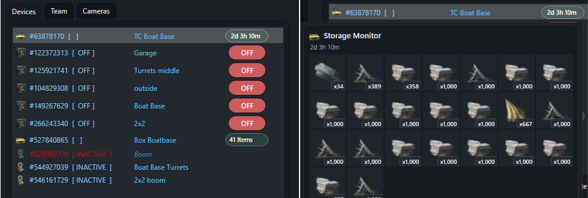  
- Shop alerts now also trigger when item was sold out and then comes back online
- Storage Monitor shows traffic light upkeep indicator (from 1 hr. and less)
- Map can be zoomed with NUM +/-
- No duplicate chat notifications when server had been desynced for a short amount of time

## Update Notes 3.0.0 (October 30th 25)
- FULL Shop Analytics Overhaul!
  This comes with instant check for profit trades, trade route check (Buy X for Y) and more
- Map Overlay
  You can draw, set markers, share your map markers with team mates
- Shop Alarm system
  Get alerts (in chat or audio alerts) when a new shop pops up or when a suspicious shop disappeared or when your desired item is back in stock
- new Patch Notes Button with all new features explained

... and more


## Update Notes 2.0.5 (October 6th 25)
- Global Device Hotkeys are here! Assign one key to multiple devices to group them together.
- new Update Button (Bug: reads current version as 0.0.0 so it will always find an update - will be fixed in the future)
- new Pairing possibility through Edge Browser + better Logs
- Mini Map Overlay for ingame use
- Crosshair Overlay
- Team Management
- Camera Support
- Promoting Teammember to Leader
- Death Markers
- Grid Corrections
- Notifications in Chat for Deaths, Spawns, Online, Offline
- added fetching icon symbols from rusthelp.com (including Blueprint Fragments)

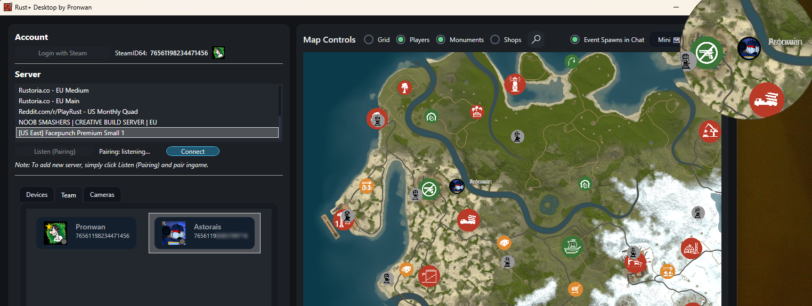  
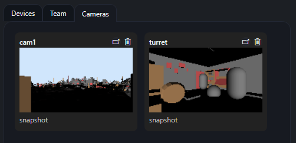 
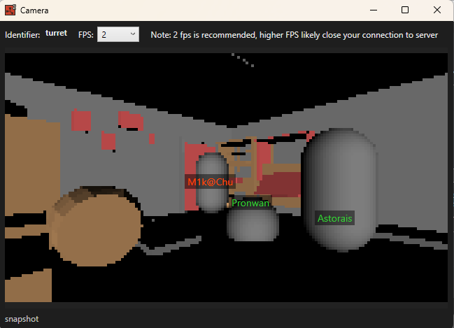 

Enjoy! :) 
---


## ✨ Features


- Pair Rust servers via Steam + Rust+ Companion
- **Player Activity Intelligence: 12-week heatmaps & 24h activity forecasts**
- **Persistent Background Tracking & System Tray integration**
- **Single Instance Management (Named Pipes)**
- Share Smart Devices and device groups with your Team
- Track Storage Monitors and Upkeep Time 
- Auto-start listener when connecting to a server
- Dynamic map (Cargo, Patrol Heli, Chinook, Travelling Vendor, Players, …)
- Smart Devices (pair in-game while connected — shows up instantly)
- Local storage of paired servers & devices, map overlays
- Vending Machine Search System for Buy and Sell orders
- Profit Trade analytics and deep trade route search (buy X for Y) 
- Open-source for transparency and trust
- Team Chat support and event spawn posts to chat
- Camera Support (no pannable cams yet)
- Mini Map and Crosshairs as Rust Overlay
- Death Markers
- Profile Icons
- Chat-Notifications for spawns, shops, deaths, events and more

---


## 🐞 Known Issues


- **Mixed languages**: Some UI texts may still show in German if a translation was missed  

- **Server-Hopping:**: Hopping through servers too quickly can cause the Listener to crash

- **Many shops**: Hovering 8+ shops at once can cause the Tooltip to flicker

- Please report other issues in the [Issues section](../../issues)

---


## 🛠️ Installation & Setup


1. **Download & install**  

   - Get the installer from **[Releases](../../releases/latest)** and run it


2. **First run**

   - Click Pairing (Listening) to start the initial setup of the Listener.
   ⚠️ **IMPORTANT**: IF error message pops up, please restart the app, rightclick on the button and click on "Try Pairing with Edge".

   - A browser popup will ask you to **pair with Companion** (Facepunch)

     let it run until it's set up (needed only once)

   - Click on "**Login with Steam**" and authorize your local PC to Steam (localhost)  

   - Allow the connection → your Steam account is linked


4. **Pair a server**  

   - In the app, click **Listening (Pairing)**  

   - In *Rust*, click the **Rust+ Pairing Link**  

   - The server will appear automatically in the app


5. **Connect**  

   - Select the server and click **Connect**  

   - Future sessions won’t require another Steam login


6. **Smart Devices**  

   - While connected, pair a device or server in-game → it appears instantly in the app

7. **If the FCM Listener won't start after a while of using the app**
   - you probably have to do the Pairing Process again.
   - Rightclick the Pairing button and select "Delete Config + Pair".
   - That's it.

8. **Alternative manuall pairing**
   - You can do the pairing manually through PowerShell. 

   - Open PowerShell, 
   - Go to your installation folder (e.g. -> a: -> cd programs -> cd RustPlusDesk)
   - Then copy paste this Power Shell code to the console. (Press enter twice) This should pair manually and open a popup in browser:

```powershell
$node = ".\runtime\node-win-x64\node.exe"
$cli  = "$env:LOCALAPPDATA\RustPlusDesk\runtime\rustplus-cli\node_modules\@liamcottle\rustplus.js\cli\index.js"
$cfg  = "$env:APPDATA\RustPlusDesk\rustplusjs-config.json"

if (!(Test-Path $cli)) {
    $zip = ".\runtime\rustplus-cli.zip"
    $dst = "$env:LOCALAPPDATA\RustPlusDesk\runtime\rustplus-cli"
    New-Item -ItemType Directory -Force -Path $dst | Out-Null
    Expand-Archive -Path $zip -DestinationPath $dst -Force
}
```

& $node $cli fcm-register --config-file "$cfg"

## 🛠️ Why initial NCM registration is required:
<details> 
   <summary> NCM Registration Explanation </summary>
On first launch, the app needs to establish a connection to the Rust+ Companion API.
For this, a bundled Node.js process (rustplus-cli) is started, which takes care of two things:

**Registration with Facepunch/Steam**

   - Opens a browser window to the official Rust+ Companion login page.

   - After logging in with Steam, an auth token is generated and passed back to the app.

   - This token is saved in the app’s config file so the process only needs to be done once per installation.

**Local listener for callbacks and notifications**

   - The Node process starts a small HTTP server on localhost:<random port> to receive the auth token.

   - Afterwards, it continues running as a background listener to receive notifications (chat, alarms, events) via Google FCM and forward them to the app.

**Requirements for successful registration**

   - Node.js runtime and rustplus-cli are shipped with the app – no manual installation required.

   - Firewall/Antivirus must not block the Node process:

   - Local loopback (127.0.0.1) must be accessible for the callback port.

**Outbound connections must be allowed on:**

   - TCP 5228–5230 (Google FCM, mtalk.google.com)

   - TCP 443 (HTTPS to Steam, Facepunch, Google)

   - Browser redirect must be allowed (some security tools or proxies may block it).

   - A valid Steam login is required to complete the auth flow.

**👉 After successful registration, the token is stored at**
%APPDATA%\RustPlusDesk\rustplusjs-config.json.
You only need to re-register if this file is missing or corrupted.
  </details>
  
<details>
<summary>🔧 Troubleshooting Registration</summary>

If the initial pairing does not work (no browser window opens, or it keeps restarting):

- **Check if Node is running**  
  - Open *Task Manager* → *Details* → look for `node.exe`.  
  - Or run:  
    ```powershell
    tasklist | findstr node.exe
    ```

- **Check if a local port is listening**  
  - Run:  
    ```powershell
    netstat -ano | findstr LISTENING | findstr 127.0.0.1
    ```
  - You should see a `127.0.0.1:<port>` entry with the same PID as `node.exe`.  
  - If not: Firewall or antivirus may be blocking the local callback server.  

- **Check outbound connections**  
  Test if the required ports are open:  
  ```powershell
  Test-NetConnection mtalk.google.com -Port 5228
  Test-NetConnection companion-rust.facepunch.com -Port 443
  Test-NetConnection steamcommunity.com -Port 443
  All should return TcpTestSucceeded : True
- **Config reset**
If all else fails, close the app and delete:
%APPDATA%\RustPlusDesk\rustplusjs-config.json
On next launch the registration will run again.
  </details>
---


## 📸 Screenshots


### Main Screenshots

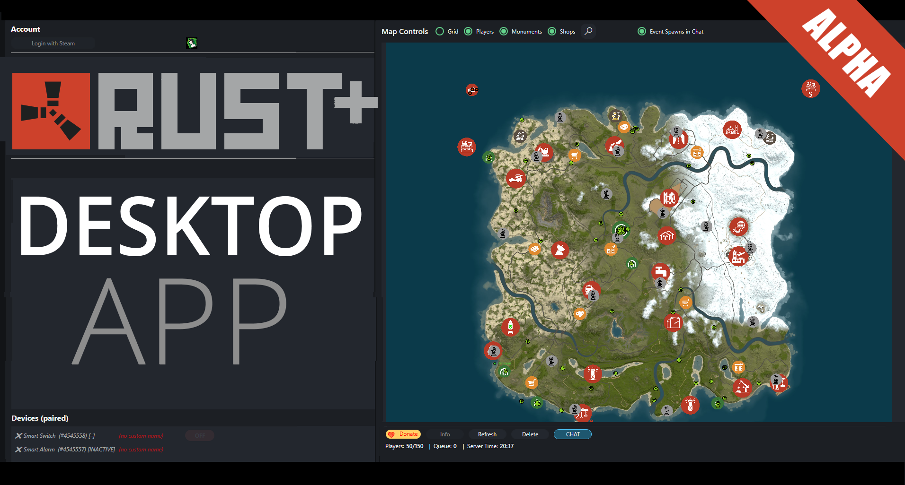  

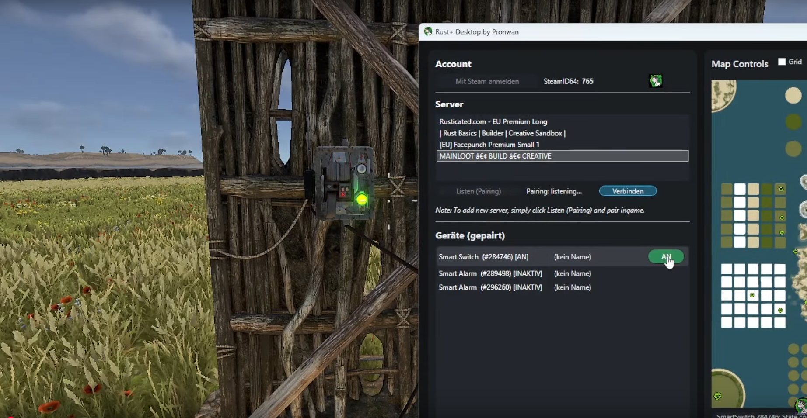  

  

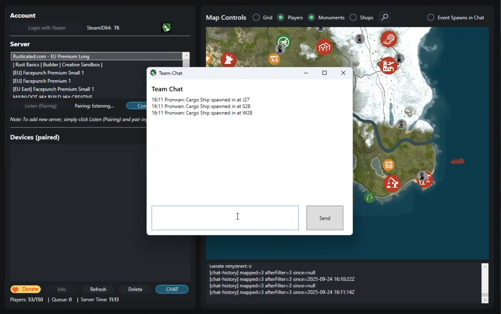  

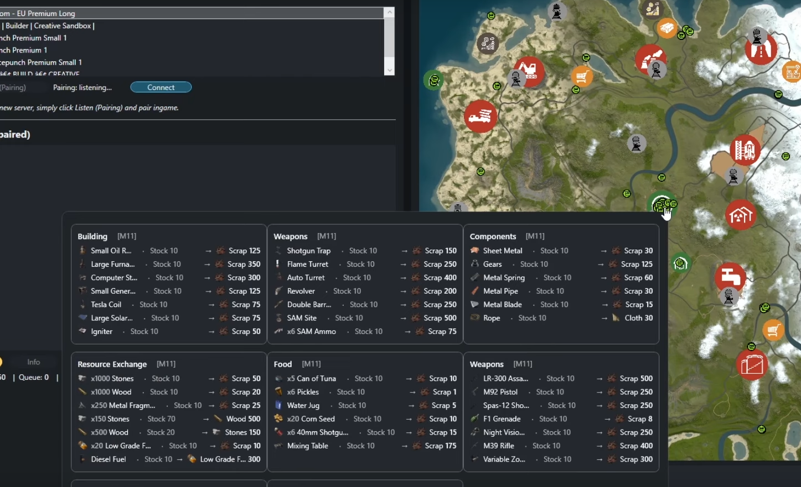  

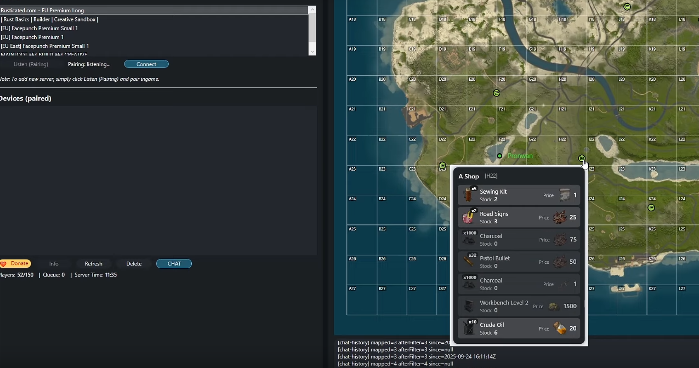  

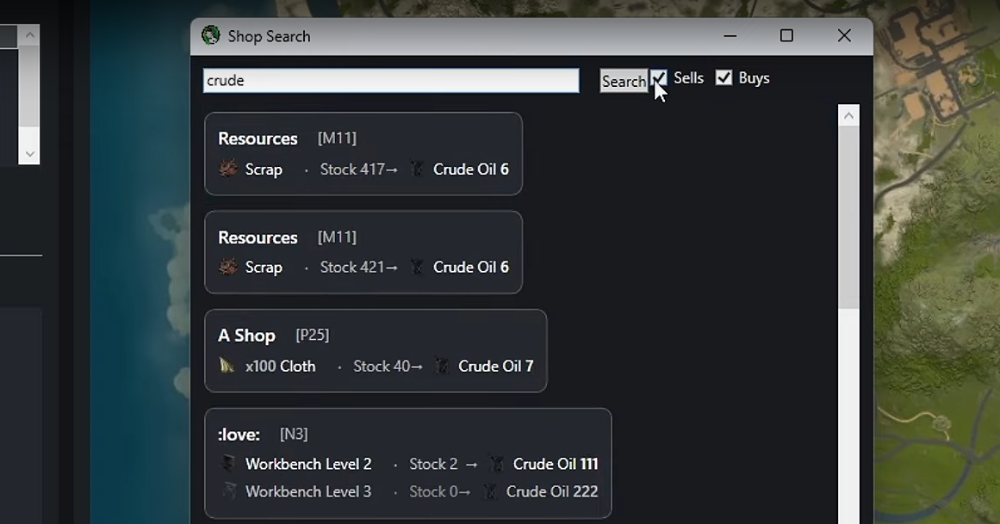  

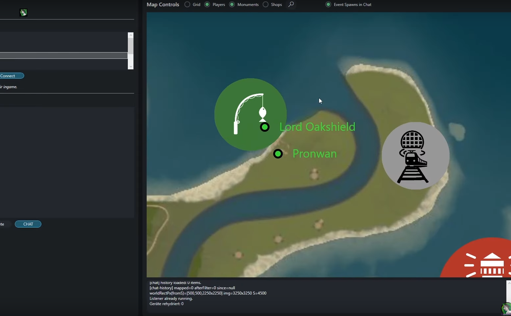


### Video Overview

[](https://www.youtube.com/watch?v=4NlFuLPK4wk)  

*(click the image to watch on YouTube)*


---


## 📜 License


This project is licensed under the [GNU GPLv3](./LICENSE).

SPDX-License-Identifier

GPL-3.0-or-later


## Release Checksum:

SHA256-Hash von RustPlusDesk-Setup.exe:

5991535374198c10a7e38748d5c698c5a69df8305ace397afc6d52fd479bf480

---


## 🙌 Contributing


Found a bug or want to help?  

Open an [Issue](../../issues) or create a Pull Request.


## Support?


Sure, why not :) 

**https://streamelements.com/pronwan/tip**

