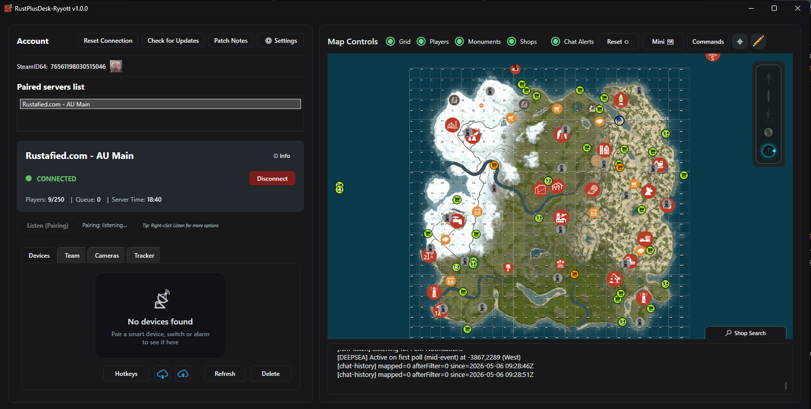
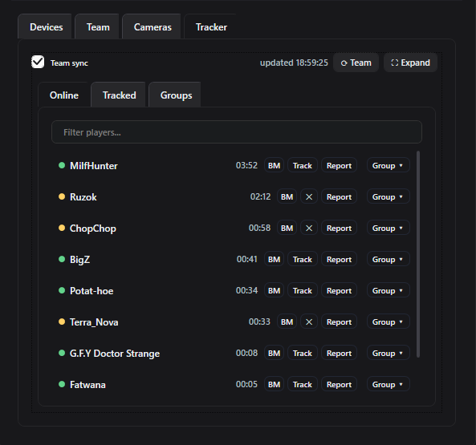
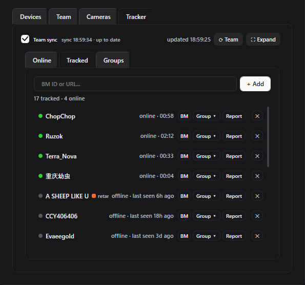
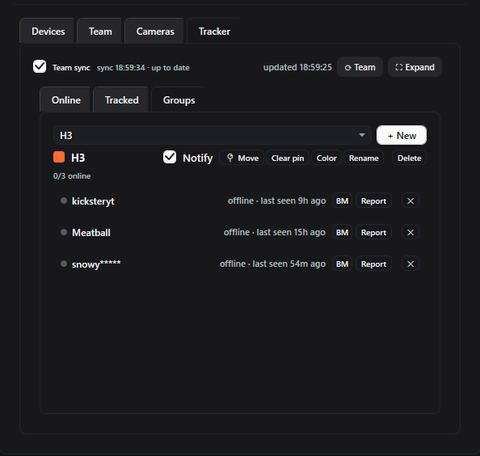
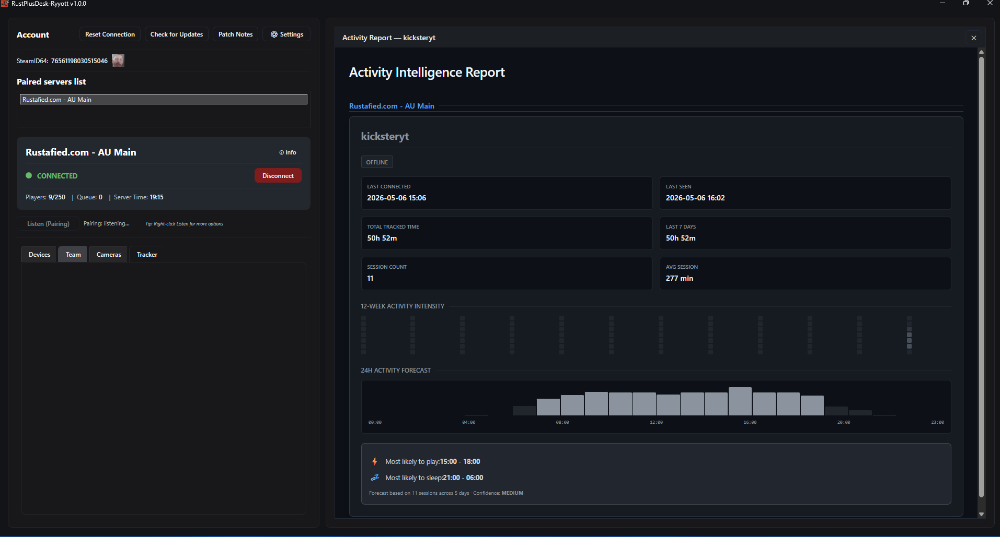
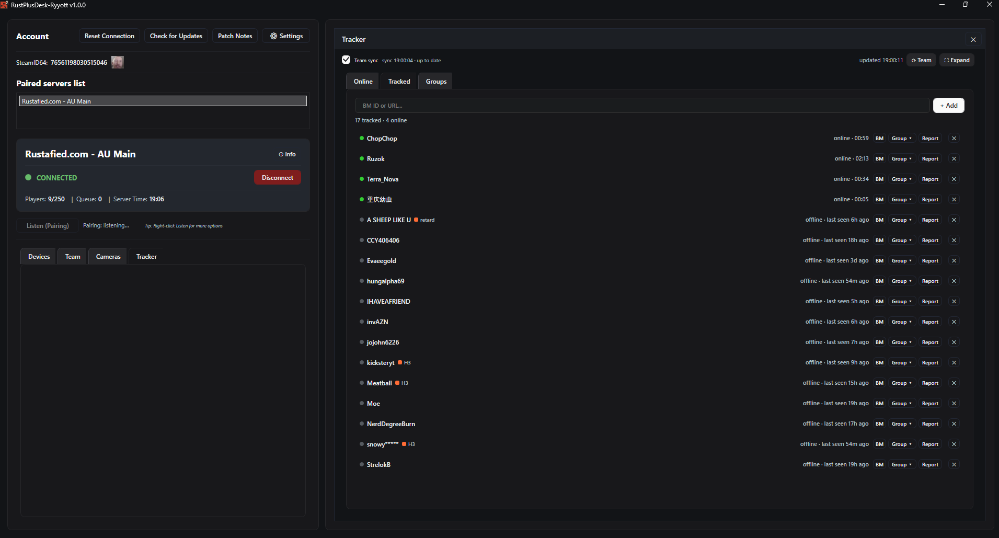

# RustPlusDesk-Ryyott

A fork of [Pronwan/rustplus-desktop](https://github.com/Pronwan/rustplus-desktop) — the unofficial Rust+ Companion app for Windows — with extra tooling for organised teams.



> **All credit for the original Rust+ Desktop app goes to [Pronwan](https://github.com/Pronwan).**
> If you find this useful, please consider supporting the original author at [patreon.com/Pronwan](https://www.patreon.com/c/Pronwan) or [streamelements.com/pronwan/tip](https://streamelements.com/pronwan/tip). This fork stands entirely on his work.

---

## What this fork adds

- **Tracker tab** — Online / Tracked / Groups sub-tabs powered by BattleMetrics. Track players across sessions, group them (H1, H3, etc.), pin group bases on the map.
- **Activity Intelligence Report** — slide-in panel over the map with a 90-day BattleMetrics session backfill, 12-week heatmap, 24h forecast, and a "most likely to play" prediction per player. Available as a Report button on every tracked or online row.
- **Tracker Expand overlay** — pop the entire Tracker tab out into a full-height slide-in over the map for dense work without losing the sidebar layout.
- **Team-sync** — share tracked players + groups across teammates using the same overlay-sync server upstream already runs (HMAC-signed, 30s pull, last-write-wins, tombstones for deletes). Opt-in via Settings.
- **Inline team chat** — replaced the standalone chat popup with an inline panel in the Team tab. Click any teammate tile to open their Steam profile in a browser.
- **shadcn-flavoured theme** — full zinc palette swap, restyled buttons (Ghost / Primary / Secondary / Destructive), modernised inputs, cards, tabs, scrollbars and dialogs.
- **Modal modernisation** — replaces the legacy `Microsoft.VisualBasic.Interaction.InputBox` and stock `MessageBox` prompts with shadcn-themed `TextInputModal` and `ConfirmModal`. Used for camera add, group create / rename / delete, "reset connection", update prompts.
- **Patch Notes & Update flows as slide-ins** — opens over the map instead of as a popup.
- **Sidebar restructure** — slimmer footer, server stats inlined into the Connection card, Reset Connection moved to the top toolbar.
- **Bug fixes** — chat duplicate-render, self-display-name flowing into the chat, mouse-wheel airspace fix that let WPF panels scroll in front of WebView2, plus a slew of button visibility fixes (Connect / Send / + Add / + New / Camera).
- **Cherry-picks upstream regularly** — most recent: Pronwan's `1535a17` "Player centering + stability + map marker addons".

For everything the original app does (smart devices, map controls, shop search, pairing, alarms, hotkeys, etc.), see [Pronwan's README](https://github.com/Pronwan/rustplus-desktop#readme).

---

## Screenshots

### New Tracker tab
A fourth tab alongside Devices / Team / Cameras, with Online / Tracked / Groups sub-tabs. Team-sync toggle at the top keeps everything in step with your group.



### Tracked players
Persistent watchlist with live online status, session timers, and per-row BM / Group / Report actions. Counter at the top shows tracked vs. currently online.



### Groups
Organise tracked players into groups (H1, H3, …) with notify toggles, map-pin colour, and rename / delete controls. Group bases pin onto the map.



### Activity Intelligence Report
Slide-in panel with a 90-day BattleMetrics session backfill: total tracked time, last 7 days, session count, average length, a 12-week activity heatmap, a 24h forecast, and a "most likely to play / sleep" prediction with confidence rating.



### Tracker Expand overlay
Pop the entire Tracker tab into a full-height slide-in over the map for dense work without losing the sidebar layout.



---

## Install (for teammates)

1. Install the **.NET 8 Desktop Runtime**:
   ```powershell
   winget install Microsoft.DotNet.DesktopRuntime.8
   ```
2. Grab the latest `RustPlusDesk-Ryyott.exe` from this repo's [Releases](../../releases) (or build from source — see below).
3. Run it. First launch will prompt you to log in with Steam; once paired, it remembers everything.
4. (Optional) Tick **Team sync** in Settings if your whole team is using this fork — it'll keep your tracked players + groups in sync within 30 seconds.

See [`docs/TEAM_SETUP.md`](docs/TEAM_SETUP.md) for the full team distribution guide.

---

## Build from source

```powershell
git clone https://github.com/ryyott/rustplus-desktop.git
cd rustplus-desktop\RustPlusDesktop
dotnet build -c Release
.\bin\Release\net8.0-windows\RustPlusDesk-Ryyott.exe
```

Requires the .NET 8 SDK.

---

## Branches

- **`main`** — stable, what the binaries in Releases are built from.
- **`ryyott-dev`** — active development. Stuff lands here first; promoted to `main` when it's ready.

---

## Contributing

Bug reports + feature requests are welcome via [Issues](../../issues). PRs too, but please keep them small and focused.

If your change is something the original app would also benefit from, consider opening it against [upstream](https://github.com/Pronwan/rustplus-desktop) instead — that helps everyone.

---

## Licence

GPL v3, same as upstream. See [LICENSE](LICENSE).

This fork preserves Pronwan's original copyright and licence headers throughout the source. All additions are released under the same GPL v3 terms.
