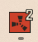

 

[](https://streamelements.com/pronwan/tip)


# Rust+ Desktop App (Unofficial)


⚠️ **Note**: This is an **unofficial** project and is not affiliated with Facepunch Studios or the game *Rust*.  

It is open source so anyone can verify there is **no malware or hidden components**.


---


## 🔍 What is this?


The **Rust+ Desktop App** is a Windows application built on the official Rust+ Companion API.  

It lets you pair Rust servers, monitor in-game events, control Smart Devices, and view dynamic map markers — all on your PC.
By now it's more than 'just' Rust Plus. It's Rust² you could say... That's why this is our new icon ;) Was about time.
  


The app ships as a single installer (bundling .NET, Node.js, WebView2 runtime, RustPlusAPI, etc.), so you don’t have to install dependencies manually.


---


## 🚀 Latest Release


➡️ **[Download the latest RustPlusDesk-Setup.exe](../../releases/latest)**


*(We publish the signed/packaged installer as a GitHub Release asset for clean versioning and smaller repositories.)*

## Update Notes 2.0 (October 1st 25)
- Mini Map Overlay for ingame use
- Crosshair Overlay
- Team Management
- Camera Support
- Promoting Teammember to Leader
- Death Markers
- Grid Corrections
- Notifications in Chat for Deaths, Spawns, Online, Offline

  
 
 

Enjoy! :) 
---


## ✨ Features


- Pair Rust servers via Steam + Rust+ Companion

- Auto-start listener when connecting to a server

- Dynamic map (Cargo, Patrol Heli, Chinook, Travelling Vendor, Players, …)

- Smart Devices (pair in-game while connected — shows up instantly)

- Local storage of paired servers & devices

- Vending Machine Search System for Buy and Sell orders

- Open-source for transparency and trust

- Team Chat support and event spawn posts to chat

- Camera Support (no pannable cams yet)

- Mini Map and Crosshairs as Rust Overlay

- Death Markers

- Profile Icons

- Chat-Notifications for spawns, deaths, events and more

---


## 🐞 Known Issues


- **Mixed languages**: Some UI texts may still show in German if a translation was missed  

- **Server-Hopping:**: Hopping through servers too quickly can cause the Listener to crash

- **Many shops**: Hovering 8+ shops at once can cause the Tooltip to flicker

- Please report other issues in the [Issues section](../../issues)

---


## 🛠️ Installation & Setup


1. **Download & install**  

   - Get the installer from **[Releases](../../releases/latest)** and run it


2. **First run**

   - A browser popup will ask you to **pair with Companion** (Facepunch)

     let it run until it's set up (needed only once)

   - Click on "**Login with Steam**" and authorize your local PC to Steam (localhost)  

   - Allow the connection → your Steam account is linked


4. **Pair a server**  

   - In the app, click **Listening (Pairing)**  

   - In *Rust*, click the **Rust+ Pairing Link**  

   - The server will appear automatically in the app


5. **Connect**  

   - Select the server and click **Connect**  

   - Future sessions won’t require another Steam login


6. **Smart Devices**  

   - While connected, pair a device in-game → it appears instantly in the app

## 🛠️ Why initial NCM registration is required:
<details> 
   <summary> NCM Registration Explanation </summary>
On first launch, the app needs to establish a connection to the Rust+ Companion API.
For this, a bundled Node.js process (rustplus-cli) is started, which takes care of two things:

**Registration with Facepunch/Steam**

   - Opens a browser window to the official Rust+ Companion login page.

   - After logging in with Steam, an auth token is generated and passed back to the app.

   - This token is saved in the app’s config file so the process only needs to be done once per installation.

**Local listener for callbacks and notifications**

   - The Node process starts a small HTTP server on localhost:<random port> to receive the auth token.

   - Afterwards, it continues running as a background listener to receive notifications (chat, alarms, events) via Google FCM and forward them to the app.

**Requirements for successful registration**

   - Node.js runtime and rustplus-cli are shipped with the app – no manual installation required.

   - Firewall/Antivirus must not block the Node process:

   - Local loopback (127.0.0.1) must be accessible for the callback port.

**Outbound connections must be allowed on:**

   - TCP 5228–5230 (Google FCM, mtalk.google.com)

   - TCP 443 (HTTPS to Steam, Facepunch, Google)

   - Browser redirect must be allowed (some security tools or proxies may block it).

   - A valid Steam login is required to complete the auth flow.

**👉 After successful registration, the token is stored at**
%APPDATA%\RustPlusDesk\rustplusjs-config.json.
You only need to re-register if this file is missing or corrupted.
  </details>
<details>
<summary>🔧 Troubleshooting Registration</summary>

If the initial pairing does not work (no browser window opens, or it keeps restarting):

- **Check if Node is running**  
  - Open *Task Manager* → *Details* → look for `node.exe`.  
  - Or run:  
    ```powershell
    tasklist | findstr node.exe
    ```

- **Check if a local port is listening**  
  - Run:  
    ```powershell
    netstat -ano | findstr LISTENING | findstr 127.0.0.1
    ```
  - You should see a `127.0.0.1:<port>` entry with the same PID as `node.exe`.  
  - If not: Firewall or antivirus may be blocking the local callback server.  

- **Check outbound connections**  
  Test if the required ports are open:  
  ```powershell
  Test-NetConnection mtalk.google.com -Port 5228
  Test-NetConnection companion-rust.facepunch.com -Port 443
  Test-NetConnection steamcommunity.com -Port 443
  All should return TcpTestSucceeded : True
- **Config reset**
If all else fails, close the app and delete:
%APPDATA%\RustPlusDesk\rustplusjs-config.json
On next launch the registration will run again.
  </details>
---


## 📸 Screenshots


### Main Screenshots

  

  

  

  

  

  

  


### Video Overview

[](https://www.youtube.com/watch?v=4NlFuLPK4wk)  

*(click the image to watch on YouTube)*


---


## 📜 License


This project is licensed under the [GNU GPLv3](./LICENSE).

SPDX-License-Identifier

GPL-3.0-or-later


## Release Checksum:

SHA256-Hash von RustPlusDesk-Setup.exe:

5991535374198c10a7e38748d5c698c5a69df8305ace397afc6d52fd479bf480

---


## 🙌 Contributing


Found a bug or want to help?  

Open an [Issue](../../issues) or create a Pull Request.


## Support?


Sure, why not :) 

**https://streamelements.com/pronwan/tip**

