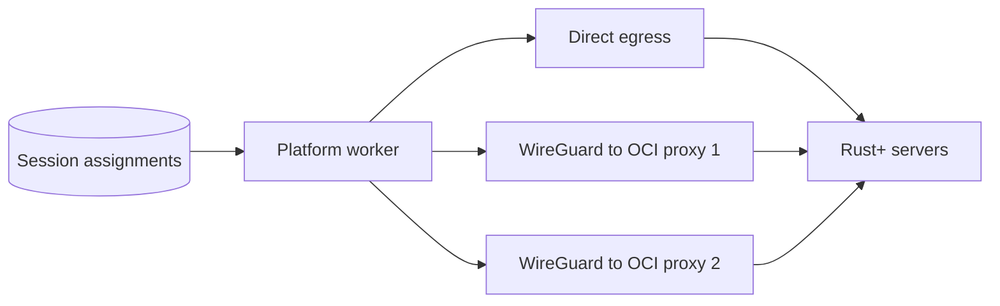

# Oracle Egress Proxy Plan

Status: Proposed  
Scope: Cloud platform and worker infrastructure  
Desktop changes: None expected

## Objective

Add optional egress IP addresses for Cloud 24/7 Rust+ connections without deploying workers to Oracle Cloud. The existing platform worker continues to own every session. Selected Rust+ WebSocket connections travel through private WireGuard tunnels to HTTP CONNECT proxies on Oracle VMs and leave through each VM's reserved public IP.



WireGuard protects access to each proxy. The application-level proxy lets the worker choose an egress endpoint per session without changing the platform host's default route.

## Constraints

- Only Rust+ WebSocket traffic may use the proxy endpoints.
- API, database, monitoring and ordinary worker traffic must retain normal platform egress.
- A session keeps a stable endpoint while that endpoint is healthy.
- One cloud session must never be active on two workers or endpoints simultaneously.
- Gateway failure requires a WebSocket reconnect; an established socket cannot migrate.
- Oracle Always Free instances are additional capacity, not the only production path, because idle instances may be reclaimed.

## Phase 1: Compatibility spike

1. Add temporary proxy configuration to one worker connection.
2. Run a local HTTP CONNECT proxy.
3. Confirm the worker's WebSocket stack accepts a per-connection proxy.
4. Connect to a test Rust server through that proxy.
5. Verify the observed source address is the proxy's public IP.
6. Verify authentication, commands, events, keepalive and reconnect behavior.
7. Confirm unrelated worker traffic does not use the proxy.

If the Rust+ library hides the underlying proxy option, expose the smallest connection option needed at the WebSocket creation point. Do not introduce host-wide routing as a workaround.

### Acceptance criteria

- One session can connect through a selected proxy.
- A second session can connect directly from the same worker process.
- Both sessions retain normal Rust+ behavior.

## Phase 2: Oracle gateway

Provision one gateway before creating the second.

### Infrastructure

- Always Free eligible Ubuntu or Oracle Linux VM.
- Reserved public IPv4 address.
- Public subnet with an internet gateway.
- WireGuard interface, for example `10.70.1.1/30`.
- Lightweight HTTP CONNECT proxy bound only to the WireGuard address.
- Terraform module and cloud-init configuration for repeatable provisioning.

### Network policy

OCI ingress permits:

- WireGuard UDP from the platform's fixed public IP.
- SSH from the administration IP, or access through OCI Bastion.

OCI ingress denies public access to the CONNECT proxy. The proxy must listen only on its WireGuard interface.

The proxy denies connections to:

- Loopback ranges.
- RFC1918 private ranges.
- Link-local ranges.
- OCI metadata endpoints.
- Any source other than the platform WireGuard peer.

Store WireGuard private keys and any proxy credentials in the platform secret store. Do not store secrets in Terraform state or the application database.

### Acceptance criteria

- The proxy port is unreachable through the VM's public address.
- The platform can reach it through WireGuard.
- Proxied connections leave through the reserved OCI address.
- Private and metadata destinations are rejected.
- Reprovisioning the VM preserves or reattaches its reserved public IP.

## Phase 3: Worker integration

Represent the available routes as named endpoints:

```text
direct
proxy:oracle-1
proxy:oracle-2
```

For each cloud session, the worker:

1. Reads the assigned endpoint.
2. Resolves its private proxy address from worker configuration.
3. Applies the proxy only to that session's WebSocket.
4. Reuses the same endpoint for reconnects while it remains healthy.
5. Reports connection success or failure against that endpoint.

Proxy addresses, keys and credentials remain deployment configuration. The database stores only stable endpoint identifiers.

### Acceptance criteria

- Direct and proxied sessions can run simultaneously in one worker process.
- Logs identify the endpoint without exposing credentials.
- Restarting the worker preserves each session's assignment.
- Platform API and database connections retain the platform's original IP.

## Phase 4: Endpoint assignments

Add an endpoint registry and a nullable assignment on cloud sessions.

```text
egress_endpoints
- id
- name
- mode                 # direct or proxy
- enabled
- healthy
- capacity
- last_healthy_at
- last_error

cloud_sessions
- egress_endpoint_id   # nullable for direct/default behavior
```

Assignment policy:

1. Preserve an existing assignment when its endpoint is enabled and healthy.
2. Assign new sessions to the least-loaded healthy endpoint with remaining capacity.
3. Include direct platform egress as an endpoint and fallback.
4. Reassign only after repeated health or connection failures.
5. Use the existing session lease or ownership mechanism to prevent duplicate connections.
6. Never rotate addresses on every reconnect.

Administrative controls should allow an operator to enable, drain or disable an endpoint and set its capacity. Draining stops new assignments while existing sessions remain until they disconnect or are deliberately migrated.

### Acceptance criteria

- Capacity limits are enforced transactionally.
- Two schedulers cannot assign the same session concurrently.
- Disabled endpoints receive no new sessions.
- Existing healthy assignments remain stable.

## Phase 5: Health and failover

Check each endpoint every 15 to 30 seconds through its actual route. A useful check confirms the tunnel, CONNECT proxy and observed public IP rather than only pinging the VM.

Track:

- Tunnel availability.
- CONNECT success and latency.
- Observed public IP.
- Assigned and active session counts.
- Rust+ connection failures.
- Reconnect count.
- Bytes transferred.
- Last successful health check.
- Last successful Rust+ connection.

Failover behavior:

1. Mark an endpoint unhealthy after several consecutive failures.
2. Stop assigning new sessions immediately.
3. Expire or clear affected assignments under the normal session lease.
4. Reconnect those sessions through another healthy endpoint.
5. Restore the endpoint only after several consecutive successful checks.

Use bounded reconnect backoff with jitter so a failed gateway does not cause every affected session to reconnect simultaneously.

### Acceptance criteria

- Losing one gateway affects only its assigned sessions.
- Affected sessions reconnect through a healthy route.
- No duplicate live session appears during reassignment.
- A flapping gateway does not repeatedly take and lose traffic.

## Phase 6: Second endpoint and rollout

1. Provision the second Oracle VM from the same Terraform module.
2. Give it a separate reserved public IP and WireGuard subnet.
3. Enable endpoint selection for internal accounts.
4. Expand to a small supporter cohort.
5. Roll out to 10%, 50% and then the intended capacity.
6. Keep direct platform egress enabled as the authoritative fallback.

Pause expansion if proxied sessions show materially worse connection time, disconnect rate or command latency.

## Validation matrix

| Scenario | Expected result |
| --- | --- |
| Direct session | Rust server sees the platform IP |
| Oracle 1 session | Rust server sees Oracle IP 1 |
| Oracle 2 session | Rust server sees Oracle IP 2 |
| Worker restart | Existing endpoint assignments are reused |
| WireGuard tunnel loss | Only sessions on that endpoint reconnect |
| Proxy process crash | Endpoint becomes unhealthy and drains |
| Oracle VM replacement | Reserved IP is reattached |
| Database/API request | Traffic uses normal platform egress |
| Public proxy scan | CONNECT port is unreachable |
| Private destination request | Proxy rejects the connection |
| Concurrent schedulers | One owner and one endpoint win transactionally |

## Rollback

Disable the proxy endpoints in the registry and clear their assignments. Sessions reconnect through direct platform egress. The worker's direct connection path remains the default throughout rollout, so rollback requires no desktop release and no infrastructure deletion.

## Estimated effort

| Work | Estimate |
| --- | --- |
| WebSocket proxy compatibility spike | 0.5–1 day |
| Terraform, VM hardening and WireGuard | 1–1.5 days |
| Worker proxy support | 1 day |
| Assignment and health logic | 1–2 days |
| Failure testing and staged rollout tooling | 1 day |

Expected implementation time is four to six engineering days, followed by several days of staged observation.

## Implementation order

Do not build the scheduler or provision both VMs before the compatibility spike passes. The smallest useful delivery is one gateway, one explicitly assigned test session and direct fallback. Add automatic balancing and the second endpoint only after that path is stable.
